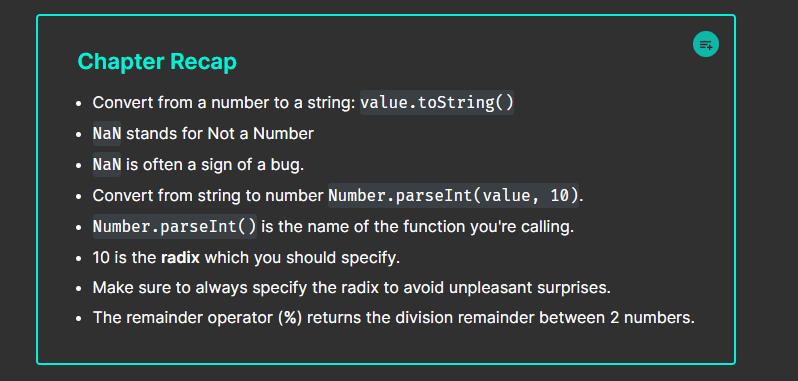

### Counter
```javascript
const reset = document.getElementById("reset");
const IncreaseB = document.getElementById("IncreaseB");
const DecreaseB = document.getElementById("DecreaseB");
const count = document.getElementById("count");

let counted = 0;

reset.onclick  = function(){
    counted = 0;
    count.textContent = counted;
}

document.getElementById("IncreaseB").onclick  = function(){
  counted += 1;
  count.textContent = counted;

}

DecreaseB.onclick = function(){
  counted -= 1;
  count.textContent = counted;
}
```

### If Else Payments
```javascript
const Subsb = document.getElementById("Subsb");
const Visa = document.getElementById("Visa");
const Master = document.getElementById("Master");
const Paid = document.getElementById("Paid");
const AreUSub = document.getElementById("AreUSub");
const Payment = document.getElementById("Payment");


Paid.onclick = function (){

  if(Subsb.checked){
    AreUSub.textContent = "Subscribed"
  }else{
    AreUSub.textContent = "Not Subscribed"
  }

  if(Visa.checked){
    Payment.textContent = "Visa"
  }else if(Master.checked){
    Payment.textContent = "Master"
  }else if(Palawan.checked){
    Payment.textContent = "Palawan"

  }

}
```


```html
<body>
       <input id="Subsb" type="checkbox" name="card">
       <label for="Subsb">Subscirbe</label><br><br>
       <input type="radio" id="Visa"  name="card">
       <label for="Visa">Visayas</label><br><br>
       <input type="radio" id="Master"  name="card" >
       <label for="Master">MasterCard</label><br><br>
       <input type="radio" id="Palawan"  name="card">
       <label for="Palawan">Palawan Express</label><br><br>

       <button type="submit" id="Paid">Submit</button>

       <p id="AreUSub"></p>
       <p id="Payment"></p>
       <script src="MyScript.js"></script>
   </body>
```

### Method Chaining
```javascript
// Method Chaining = Calling one method after another
//                                    in one continuous line of code.

let username = window.prompt("Enter your username: ");

// ---- NO METHOD CHAINING ----

username = username.trim();
let letter = username.charAt(0);
letter = letter.toUpperCase();

let extraChars = username.slice(1);
extraChars = extraChars.toLowerCase();
username = letter + extraChars;

console.log(username);


// ---- METHOD CHAINING ----

username = username.trim().charAt(0).toUpperCase() + username.trim().slice(1).toLowerCase();

console.log(username);
```


### Opertors   
```javascript
//   = assignment operator
//  == comparison operator (compare if values are equal)
// === strict equality operator (compare if values & datatype are equal)
//  != inequality operator
// !== strict inequality operator
```

### Guessing Game

```javascript
const minNum = 1;
const maxNum = 100;
const answer = Math.floor(Math.random() * (maxNum - minNum + 1)) + minNum;

let attempts = 0;
let guess;
let running = true;

while(running){
    
    guess = window.prompt(`Guess a number between ${minNum} - ${maxNum}`);
    guess = Number(guess);
    
    if(isNaN(guess)){
        window.alert("Please enter a valid number");
    }
    else if(guess < minNum || guess > maxNum){
        window.alert("Please enter a valid number");
    }
    else{
        attempts++;
        if(guess < answer){
            window.alert("TOO LOW! TRY AGAIN!");
        }
        else if(guess > answer){
            window.alert("TOO HIGH! TRY AGAIN!");
        }
        else{
            window.alert(`CORRECT! The answer was ${answer}. It took you ${attempts} attempts`);
            running = false;
        }
    }
}
```

### Spread Operator

```javascript
// spread operator =  ... allows an iterable such as an
//                                  array or string to be expanded
//                                   in to separate elements
//                                  (unpacks the elements)

// ------------ EXAMPLE 1 ------------
let numbers = [1, 2, 3, 4, 5];
let maximum = Math.max(...numbers);
let minimum = Math.min(...numbers);

console.log(maximum);

// ------------ EXAMPLE 2 ------------
let username = "Bro Code";
let letters = [...username]; 

console.log(letters);
```

### Rest Operator
```javascript
// rest parameters = (...rest) allow a function work with a variable
//                                  number of arguments by bundling them into an array

//                                 spread = expands an array into separate elements
//                                 rest = bundles separate elements into an array

// -------- EXAMPLE 1 --------
function openFridge(...foods){
    console.log(...foods);
}
function getFood(...foods){
    return foods;
}

const food1 = "pizza";
const food2 = "hamburger";
const food3 = "hotdog";
const food4 = "sushi";
const food5 = "ramen";

openFridge(food1, food2, food3, food4, food5);

const foods = getFood(food1, food2, food3, food4, food5);

// -------- EXAMPLE 2 --------
function sum(...numbers){

    let result = 0;
    for(let number of numbers){
        result += number;
    }
    return result;
}

function getAverage(...numbers){

    let result = 0;
    for(let number of numbers){
        result += number;
    }
    return result / numbers.length;
}

const average = getAverage(75, 100, 85, 90, 50);

console.log(average);
```

### CallBacks  
  
```javascript
hello(goodbye);

function hello(callback){
    console.log("Hello!");
    callback();
}

function goodbye(){
    console.log("Goodbye!");
}
```

### Short Cut in Functions or Expressions

```javascript
// function expressions = a way to define functions as
//                                          values or variables

const numbers = [1, 2, 3, 4, 5, 6];

const squares = numbers.map(function(element){
    return Math.pow(element, 2);
});
const cubes = numbers.map(function(element){
    return Math.pow(element, 3);
});
const evenNums = numbers.filter(function(element){
    return element % 2 === 0;
});
const oddNums = numbers.filter(function(element){
    return element % 2 !== 0;
});
const total = numbers.reduce(function(accumulator, element){
    return accumulator + element;
});

console.log(total);
```
  
  
### Arrow Functions

```javascript

// arrow functions = a concise way to write function expressions
//                                good for simple functions that you use only once
//                                (parameters) => some code

// ---------- EXAMPLE 1 ----------
const hello = (name, age) => {console.log(`Hello ${name}`)
                              console.log(`You are ${age} years old`)};
   
hello("Bro", 25);
  
// ---------- EXAMPLE 2 ----------
setTimeout(() => {console.log("Hello"); 
                  console.log("Goodbye");}, 3000);

// ---------- EXAMPLE 3 ----------               
const numbers = [1, 2, 3, 4, 5, 6];

const squares = numbers.map((element) => Math.pow(element, 2));
const cubes = numbers.map((element) => Math.pow(element, 3));
const evenNums = numbers.filter((element) => element % 2 === 0);
const oddNums = numbers.filter((element) => element % 2 !== 0);
const total = numbers.reduce((accumulator, element) => accumulator + element);

console.log(total);
let count = 0;

const  Increment = document.getElementById("Increment");

Increment.onclick = () => {
count += 1;
Increment.textContent = count};
```

### Objects

```javascript
// object = A collection of related properties and/or methods
//                Can represent real world objects (people, products, places)
//                object = {key:value,
//                                 function()}

const person1 = {
  firstName: "Spongebob",
  lastName: "Squarepants",
  age: 30,
  isEmployed: true,
  sayHello: () => {console.log("Hi! I am Spongebob!")},
  eat: function(){console.log("I am eating a Krabby Patty")},
}


console.log(person1.firstName);
person1.sayHello();
person1.eat();
```
  
  
### Constructor

```javascript
// constructor = special method for defining the
//                          properties and methods of objects

function Car(make, model, year, color){
    this.make = make,
    this.model = model,
    this.year = year,
    this.color = color,
    this.drive = function(){console.log(`You drive the ${this.model}`)}
}

const car1 = new Car("Ford", "Mustang", 2024, "red");
const car2 = new Car("Chevrolet", "Camaro", 2025, "blue");
const car3 = new Car("Dodge", "Charger", 2026, "silver");

car1.drive();
car2.drive();
car3.drive();

console.log(car1.make);
console.log(car1.model);
console.log(car1.year);
console.log(car1.color);

console.log(car2.make);
console.log(car2.model);
console.log(car2.year);
console.log(car2.color);

console.log(car3.make);
console.log(car3.model);
console.log(car3.year);
console.log(car3.color);
```
  
  
### JavaScript CLOSURES  
  
```javascript

//Example 1

function outer(){
  let mex = "Hello";

  function inner(){
    console.log(mex);
  }

  inner();
}

outer();

//Example 2

function CreateCounter(){
  let count = 0;

  function Increment(){
    count++;
    console.log(`Your Counts is ${count}`);
  }

  function getCount(){
    return count;
  }
  return{Increment ,getCount }; // return the many functions
  return{Increment}; // return the value of the new Count
}

const Counter = CreateCounter();
Counter.Increment();
Counter.Increment();


console.log(Counter.count); // Undefined Because Count is Private
console.log(`Your Current Count is: ${Counter.getCount()}`); // Now Can Access it  
  
  
// Exampke 3  

function PrivateSCore(){

let score = 0;

function increaseScore(points){
  score+= points;
  console.log(`+${points}pts`);
}

function DecreaseScore(points){
  score-= points;
  console.log(`-${points}pts`);
}

function getScore(){
 return score;
}

return{increaseScore, DecreaseScore, getScore};
}


const game = PrivateSCore();
console.log(` Your Score is ${game.getScore()} `);
game.increaseScore(9);
game.increaseScore(8);
console.log(` Your Score is ${game.getScore()} `);
game.DecreaseScore(4);
console.log(` Your Score is ${game.getScore()} `);  
```
  
  
### ES6  
  
```javascript
/ ES6 Module = An external file that contains reusable code
//              that can be imported into other JavaScript files
//              Can contain variables, classes, functions ... and more
//              Introduced as part of ECMAScript 2015 update

// --------- index.js ---------

import {PI, getCircumference, getArea, getVolume} from './mathUtil.js';

console.log(PI);
const circumference = getCircumference(10);
const area = getArea(10);
const volume = getVolume(10);

console.log(`${circumference.toFixed(2)}cm`);
console.log(`${area.toFixed(2)}cm^2`);
console.log(`${volume.toFixed(2)}cm^3`);

// --------- mathutil.js ---------

export const PI = 3.14159;

export function getCircumference(radius){
    return 2 * PI * radius;
}

export function getArea(radius){
    return PI * radius * radius;
}

export function getVolume(radius){
    return 4 * PI * radius * radius;
}
```

### arrow FUNCTIONS


### SCOPE VARIABLE 

```javascript
const logSkyColor = () => {
  const dusk = true;
  let color = 'blue'; 
  if (dusk) {
    let color = 'pink';
    console.log(color); // Prints "pink"
  }
  console.log(color); // Prints "blue"
};

console.log(color); // throws a ReferenceError

```

```javascript
const famousSayings = [ 
  ['Fortune favors the brave.', 8 ],
  ['A joke is a very serious thing.' , 9 ],
  ['HJikpoe', 9] ];


// Access elements in the 2D array
const firstRow = famousSayings[0]; // First sub-array
const firstRowFirstElement = famousSayings[0][0]; // 'Fortune favors the brave.'
const secondRowSecondElement = famousSayings[1][1]; // 9

console.log(firstRow); // ['Fortune favors the brave.', 8]
console.log(firstRowFirstElement); // 'Fortune favors the brave.'
console.log(secondRowSecondElement); // 9

all array functions


```
[Codecademy JavaScript Arrays Documentation](https://www.codecademy.com/resources/docs/javascript/arrays)

Iterators In JAVA SCRIPT

```javascript
const jumbledNums = [123, 25, 78, 5, 9]; 

const lessThanTen = jumbledNums.findIndex(num => {
  return num < 10;
});
 //Preview: Docs Returns the first index that passes the callback function's test. Returns -1 if no element passes the test. .findIndex()

 //on an array will return the index of the first element that evaluates to true in the callback function.

const fruits = ['mango', 'papaya', 'pineapple', 'apple'];

// Iterate over fruits below
fruits.forEach( baka => {
console.log(`I want to eat a ${baka}`);
});

//When  Preview: Docs Loading link description .map()

 //is called on an array, it takes an argument of a callback function and returns a new array!

const animals = ['Hen', 'elephant', 'llama', 'leopard', 'ostrich', 'Whale', 'octopus', 'rabbit', 'lion', 'dog'];

// Create the secretMessage array below

const  secretMessage = animals.map(baka => {
return baka[0];
});

//T he .filter() array method creates a new array with all elements that pass the test from the provided function.

const words = ['chair', 'music', 'pillow', 'brick', 'pen', 'door']; 

const shortWords = words.filter(word => {
  return word.length < 6;
});


const numbers = [1, 2, 4, 10];

const summedNums = numbers.reduce((accumulator, currentValue) => {
  return accumulator + currentValue
})

console.log(summedNums) // Output: 17

// The .reduce() method combines each element of an array, using a specified reducer function, and returns a single value.


const numbers = [1, 2, 4, 10];

const summedNums = numbers.reduce((accumulator, currentValue) => {
  return accumulator + currentValue
}, 100)  // <- Second argument for .reduce()

console.log(summedNums); // Output: 117


// ALL TEST

const cities = ['Orlando', 'Dubai', 'Edinburgh', 'Chennai', 'Accra', 'Denver', 'Eskisehir', 'Medellin', 'Yokohama'];

const nums = [1, 50, 75, 200, 350, 525, 1000];

//  Choose a method that will return undefined
cities.forEach(city => console.log('Have you visited ' + city + '?'));

// Choose a method that will return a new array
const longCities = cities.filter(city => city.length > 7);

// Choose a method that will return a single value
const word = cities.reduce((acc, currVal) => {
  return acc + currVal[0]
}, "C");

console.log(word)

// Choose a method that will return a new array
const smallerNums = nums.map(num => num - 5);

// Choose a method that will return a boolean value
nums.some(num => num < 0);


```


### OBJECTS 


```javascript
// An object literal with two key-value pairs
let spaceship = {
  'Fuel Type': 'diesel',
  color: 'silver'
};
```
### ASSIGNING AND DELETING 
```javascript
const spaceship = {
  'Fuel Type' : 'Turbo Fuel',
  homePlanet : 'Earth',
  color: 'silver',
  'Secret Mission' : 'Discover life outside of Earth.'
};
spaceship.color = 'glorious gold';
spaceship.numEngines = 9;
delete spaceship['Secret Mission'];

  console.log(spaceship)
```
### nested objects
```javascript
let spaceship = {
  passengers: null,
  telescope: {
    yearBuilt: 2018,
    model: "91031-XLT",
    focalLength: 2032 
  },
  crew: {
    captain: { 
      name: 'Sandra', 
      degree: 'Computer Engineering', 
      encourageTeam() { console.log('We got this!') },
     'favorite foods': ['cookies', 'cakes', 'candy', 'spinach'] }
  },
  engine: {
    model: "Nimbus2000"
  },
  nanoelectronics: {
    computer: {
      terabytes: 100,
      monitors: "HD"
    },
    'back-up': {
      battery: "Lithium",
      terabytes: 50
    }
  }
}; 

const capFave = spaceship.crew.captain['favorite foods'][0];

spaceship.passengers = [{
  name: 'Jony',
  age: 90,
}];

spaceship.passengers[0].MINE = "MY belongings";

const firstPassenger = spaceship.passengers[0];

```
### Pass By Reference
```javascript
let spaceship = {
  'Fuel Type' : 'Turbo Fuel',
  homePlanet : 'Earth'
};

const greenEnergy =  obj => {
obj['Fuel Type'] = 'avocado oil';
}

const remotelyDisable = obj => {
 obj.disabled = true;
}
greenEnergy(spaceship);
remotelyDisable(spaceship);
console.log(spaceship);


Output-only Terminal
Output:
{ 'Fuel Type': 'avocado oil',
  homePlanet: 'Earth',
  disabled: true }

```

### Looping Through Objects
```javascript
let spaceship = {
    crew: {
    captain: { 
        name: 'Lily', 
        degree: 'Computer Engineering', 
        cheerTeam() { console.log('You got this!') } 
        },
    'chief officer': { 
        name: 'Dan', 
        degree: 'Aerospace Engineering', 
        agree() { console.log('I agree, captain!') } 
        },
    medic: { 
        name: 'Clementine', 
        degree: 'Physics', 
        announce() { console.log(`Jets on!`) } },
    translator: {
        name: 'Shauna', 
        degree: 'Conservation Science', 
        powerFuel() { console.log('The tank is full!') } 
        }
    }
}; 

// Write your code below

for (let crewMember in spaceship.crew) {
  console.log(`${crewMember}: ${spaceship.crew[crewMember].name}`)
};

for( let baka in spaceship.crew ){
  console.log(`${baka}: ${spaceship.crew[baka].degree}`)
}
```
### Reviw in Objects


### Advanced Objects

THIS keyword

```javascript
const goat = {
  dietType: 'herbivore',
  makeSound() {
    console.log('baaa');
  },
  diet() {
    console.log(this.dietType);
  }
};

goat.diet(); 
// Output: herbivore
```
```javascript
//The key takeaway from the example above is to avoid using arrow functions when using this in a method!
const goat = {
  dietType: 'herbivore',
  makeSound() {
    console.log('baaa');
  },
  diet: () => {
    console.log(this.dietType);
  }
};

goat.diet(); // Prints undefined
```

## Getters
```javascript
const robot = {
  _model: '1E78V2',
  _energyLevel: 100,
  get energyLevel() {
    if( typeof this._energyLevel === `number` ){
      return 'My current energy level is ' + this._energyLevel;
    }else{
      return "System malfunction: cannot retrieve energy level";
    }
  }
};

console.log(robot.energyLevel);
// My current energy level is 100

```

## Setters

```javascript
// setter methods which reassign values of existing properties within an object
const person = {
  _age: 37,
  set age(newAge){
    if (typeof newAge === 'number'){
      this._age = newAge;
    } else {
      console.log('You must assign a number to age');
    }
  }
};


person.age = 40;
console.log(person._age); // Logs: 40
person.age = '40'; // Logs: You must assign a number to age


//SECOND

const robot = {
  _model: '1E78V2',
  _energyLevel: 100,
  _numOfSensors: 15,
  get numOfSensors(){
    if(typeof this._numOfSensors === 'number'){
      return this._numOfSensors;
    } else {
      return 'Sensors are currently down.'
    }
  },
  set numOfSensors(num){
    if(typeof num === 'number' && num >= 0){
        this._numOfSensors = num;
    }else{
     console.log ('Pass in a number that is greater than or equal to 0')
    }
  }
};

robot.numOfSensors = 100;

console.log(robot._energyLevel)
//100

```


### Setters and Getters 
```javascript
class Person {
  constructor(firstName, lastName) {
    this._firstName = firstName;
    this._lastName = lastName;
  }

  // Getter for the full name
  get fullName() {
    return `${this._firstName} ${this._lastName}`;
  }

  // Setter for the full name
  set fullName(name) {
    const parts = name.split(" ");
    this._firstName = parts[0]; // First word
    this._lastName = parts[1] || ""; // Second word or empty string
  }
}

const person = new Person("Spongebob", "Squarepants");

console.log(person.fullName); // Spongebob Squarepants

person.fullName = "Patrick Star"; // Using the setter
console.log(person.fullName); // Patrick Star

```
### Factory Functions

```javascript
// EXAMPLE 1
const monsterFactory = (name, age, energySource, catchPhrase) => {
  return { 
    name: name,
    age: age, 
    energySource: energySource,
    scare() {
      console.log(catchPhrase);
    } 
  }
};
const ghost = monsterFactory('Ghouly', 251, 'ectoplasm', 'BOO!');
ghost.scare(); // 'BOO!'


// EXAMPLE 2

const robotFactory = ( model , mobile) => {
return {
  model: model,
  mobile: mobile,
  beep () {
    console.log('Beep Boop')
  }
}
};

const tinCan = robotFactory('P-500' , true);
tinCan.beep();
//Beep Boop
```
### Destructured Assignment

```javascript
const vampire = {
  name: 'Dracula',
  residence: 'Transylvania',
  preferences: {
    day: 'stay inside',
    night: 'satisfy appetite'
  }
};
//If we wanted to extract the residence property as a variable, we could use the following code:
const residence = vampire.residence; 
console.log(residence); // Prints 'Transylvania' 


//destructured assignment to save ourselves some keystrokes.

const { residence } = vampire; 
console.log(residence); // Prints 'Transylvania'

//We can even use destructured assignment to grab nested properties of an object:

const { day } = vampire.preferences; 
console.log(day); // Prints 'stay inside'

```


### Built-in Object Methods


```javascript 
const robot = {
	model: 'SAL-1000',
  mobile: true,
  sentient: false,
  armor: 'Steel-plated',
  energyLevel: 75
};

// What is missing in the following method call?
const robotKeys = Object.keys(robot);

console.log(robotKeys);

// Declare robotEntries below this line:
const robotEntries = Object.entries(robot);

console.log(robotEntries);

// Declare newRobot below this line:
const newRobot = Object.assign({laserBlaster: true, voiceRecognition: true} , robot);

console.log(newRobot);
```


### Introduction to Classes
```javascript 
class Dog {
  constructor(name) {
    this._name = name;
    this._behavior = 0;
  }

  get name() {
    return this._name;
  }
  get behavior() {
    return this._behavior;
  }   

  incrementBehavior() {
    this._behavior ++;
  }
}

const halley = new Dog('Halley');
console.log(halley.name); // Print name value to console
console.log(halley.behavior); // Print behavior value to console
halley.incrementBehavior(); // Add one to behavior
console.log(halley.name); // Print name value to console
console.log(halley.behavior); // Print behavior value to console
```


### Instance
```javascript
An instance is an object that contains the property names and 
Preview: Docs Methods are object properties that contain functions.
methods
 of a class, but with unique property values.

class Dog {
  constructor(name) {
    this.name = name;
    this.behavior = 0;
  } 
}

const halley = new Dog('Halley'); // Create new Dog instance
console.log(halley.name); // Log the name value saved to halley
// Output: 'Halley'

```

### Inheritance 


```javascript
In the example above, the Animal class contains the properties and methods that the Cat and Dog classes share (name, behavior, .incrementBehavior()).

The diagram to the right shows the relationships we want to create between the Animal, Cat, and Dog classes.
```
```javascript
class Animal {
  constructor(name) {
    this._name = name;
    this._behavior = 0;
  }
    
  get name() {
    return this._name;
  }
  
  get behavior() {
    return this._behavior;
  }
    
  incrementBehavior() {
    this._behavior++;
  }
} 


class Cat extends Animal {
  constructor(name, usesLitter) {
    super(name);
    this._usesLitter = usesLitter;
  }
}

const bryceCat = new Cat('Bryce', false); 
console.log(bryceCat._name); // output: Bryce


// do this
class Animal {
  constructor(name) {
    this._name = name;
    this._behavior = 0;
  }
    
  get name() {
    return this._name;
  }
  
  get behavior() {
    return this._behavior;
  }
    
  incrementBehavior() {
    this._behavior++;
  }
} 


class Cat extends Animal {
  constructor(name, usesLitter) {
    super(name);  // super() calls the parent class constructor and allows the child class to inherit and initialize the properties of the parent class.
    this._usesLitter = usesLitter;
  }
}


```

### FINAL INHERETANCE
```javascript
class HospitalEmployee {
  constructor(name) {
    this._name = name;
    this._remainingVacationDays = 20;
  }
  
  get name() {
    return this._name;
  }
  
  get remainingVacationDays() {
    return this._remainingVacationDays;
  }
  
  takeVacationDays(daysOff) {
    this._remainingVacationDays -= daysOff;
  }
}

class Nurse extends HospitalEmployee {
  constructor(name, certifications) {
    super(name);
    this._certifications = certifications;
  }

  get certifications (){
    return  this._certifications ;
  }

  addCertification (newCertification){
    this._certifications.push(newCertification);
  }
}

const nurseOlynyk = new Nurse('Olynyk', ['Trauma','Pediatrics']);
nurseOlynyk.takeVacationDays(5);
console.log(nurseOlynyk.remainingVacationDays);
nurseOlynyk.addCertification('Genetics');
console.log(nurseOlynyk.certifications)
```

### Static Methods 
```javascript
class Animal {
  constructor(name) {
    this._name = name;
    this._behavior = 0;
  }
    
  static generateName() {
    const names = ['Angel', 'Spike', 'Buffy', 'Willow', 'Tara'];
    const randomNumber = Math.floor(Math.random()*5);
    return names[randomNumber];
  }
}

//EXAMPLE 1

console.log(Animal.generateName()); // returns a name

//EXAMPLE 2
const tyson = new Animal('Tyson'); 
tyson.generateName(); // TypeError


```
### Review: Classes


