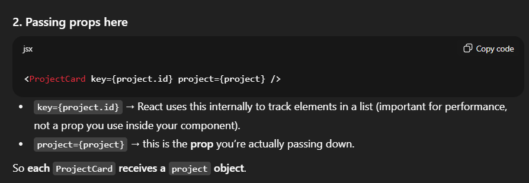
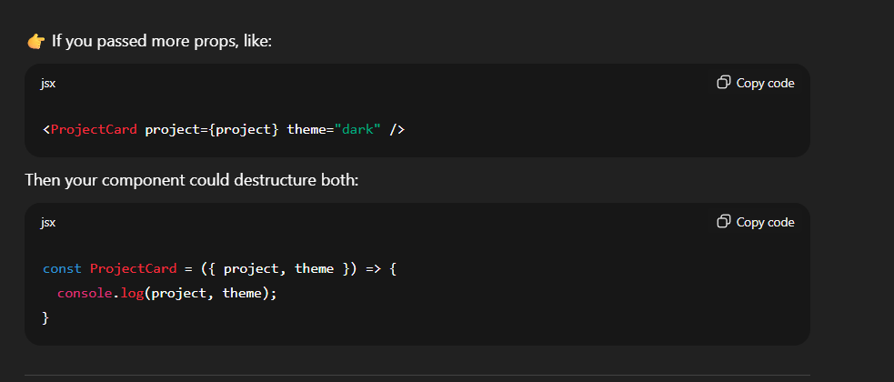

##  Public // BASIC


# 🧩 1. React apps are bundled

When you run npm run build (or Vite’s equivalent), React bundles everything inside src/ — it processes, renames, and optimizes your files.

That means:

Images in src/ don’t actually exist as normal files after build.

They become imported modules (with hashed names like drumkit.89e12.jpg).

So you can’t just point to "../images/drumkit.jpg" anymore — that path disappears.

That’s why, inside src/, you must import them:

```js
import drumkit from "../images/drumkit.jpg";
```

# 📂 2. The public/ folder is not bundled

Everything you put inside public/ is copied directly to the final build without modification.

That means:

The folder structure and filenames stay exactly the same.

You can access them with a normal URL path (like /images/drumkit.jpg).

You don’t need to import them — just reference them directly.


## Home 
# 1. The <div className='project_grid'> {projects.map(...)} </div> part



# 3. Destructuring props 

Normally, React gives you props as one object:

```jsx
const ProjectCard = (props) => {
  console.log(props.project); // access project
}
// But instead of doing props.project, you "destructure" immediately in the function signature:

const ProjectCard = ({ project }) => {
  console.log(project); // directly get project
}
```
# 4. Why only one parameter?
React automatically uses key internally, so your component only "receives" this part:
```js
{ project: project }

```


## Project.js

```js
const projects = [...]
//This just declares a constant variable called projects
```

```js
export const projects = [...]

// This makes the variable available to other files.

// Without export, only this file would know about projects.
```
```jsx
import { projects } from "../data/projects";
//That import { projects } is possible only because you used export in the first place.
```


