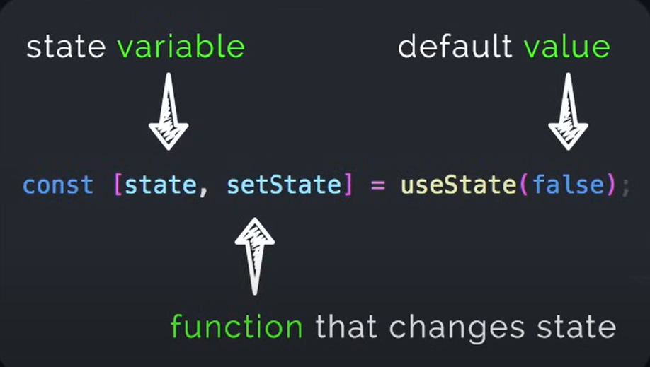

# React 
React is a JavaScript library used for building user interfaces (UIs) — especially for single-page applications
# Why React?

✅ Component-Based
You can break down your UI into small, reusable pieces (components). This makes code modular, reusable, and easier to manage.

✅ Fast Rendering with Virtual DOM
React uses a virtual DOM to minimize real DOM updates, which makes apps faster and more responsive.


✅ JSX Syntax
You write HTML-like code inside JavaScript  readable.


# How is React Used?

React is used to create web apps, dashboards, forms, dynamic UIs, and mobile apps (via React Native).


# Vite.config.js
This File allows you to build process such as  adding plugins, configuring servers
mostly optional for basic project
Useful for advance customization


# package.json 
This contains the metadata of our project like name, scripts, and dependecies used in the project


# package lock.json
It locks down the  versions of dependencies that install in the project
So this will make sure that when a user runs the project it gurantees the same version

# Index. HTML
This is the main html file within the app is loaded it has a basic structure
This includes the root div

# Eslint.config.js
This is the config file used to define rules and settings for ES Lint 

So ES linnt is a popular linting tool it helps you identitfy and fix problems 

# Git ignore
This file tells git which files or folders to ignore when committing
Most important to ignore is the node modules 

# Node Modules
This contains all the dependencies this file is very huge 

# public folder 
This has assets , images and other files

# src folder 
Main code here like javascript, html, etc

# App jsx
So this is the Main UI of your app is defined


# main jsx
This where react rendered to the DOM

# Index.css
THis is the global csss

# Props
Short For Properties
This is the way to pass data from one component to another 
So props are like arguments that to pass ina function

# State
So State is like a react's component brain
It holds Information about the components that can change over time

# Use
everything starts with Use is a hook

```jsx

const [Variable , setVariable] = Usestate();
useState(false); // inside the parenthesis is the defualt valyue of that state
```



# Hooks
Hook are Special Functions in react let you tap into react features like state management

# useState
For managing 

# useEffect 
For handling side effects like data fetching

# usecContext
For sharing data accross components

# useCallback
For optimizing callback functions

# useEffect
Is a special tool that lets you do things outside of just displaying stuff
On the Screen like fetching data from the server

```jsx
// Common Use cases of UseEffect
useEffect(() => {
 console.log(`${title} has been ${hasLiked}`);
}, [])
```

# Conditional Redering
If we want to see tha count its not equal to zero

```jsx
<h2> {title} {count || null }</h2>
```

# Full App.jsx Example
```jsx
/* eslint-disable no-unused-vars */
import { useState, useEffect } from 'react'  // need to import Use state before using it


const Card = ({title }) => {  // Accpet  props then do something
 const [hasLiked , sethasLiked] = useState(false);
  const [Count, setCount] = useState(0);
 useEffect( () => {
  console.log(`${title} has been ${hasLiked}`);
 } , [hasLiked]); // react will have to recalculate and then see it has been changed if it is changed this effect is called 

  return (
    <div className='Card' onClick={ () => {setCount(Count + 1)} }>
      <h2>Movie Name{title } <br/>{Count || null}</h2>
      <button onClick={ () => { sethasLiked(!hasLiked)}}>  {/* What Happens when the button is clicked*/}
      {hasLiked ? 'Liked': 'Like'}
      </button>
    </div>
      
  )

}

const App = () => {

  const [hasLiked , sethasLiked] = useState(false); // inside the parenthesis is the defualt valyue of that state

  return (
    <div className='cardContainer'>
    <Card title = "Star Wars" ratings = {5.9} isCool = {true} actors = { [ { name: "albert"} ,  {name: 'Mohamaed'} ] }/>
    <Card title = "Lion King" ratings = {5.9} isCool = {true} actors = { [ { name: "Einstined"} ] }/>
    </div>
   
  )
}

export default App

```